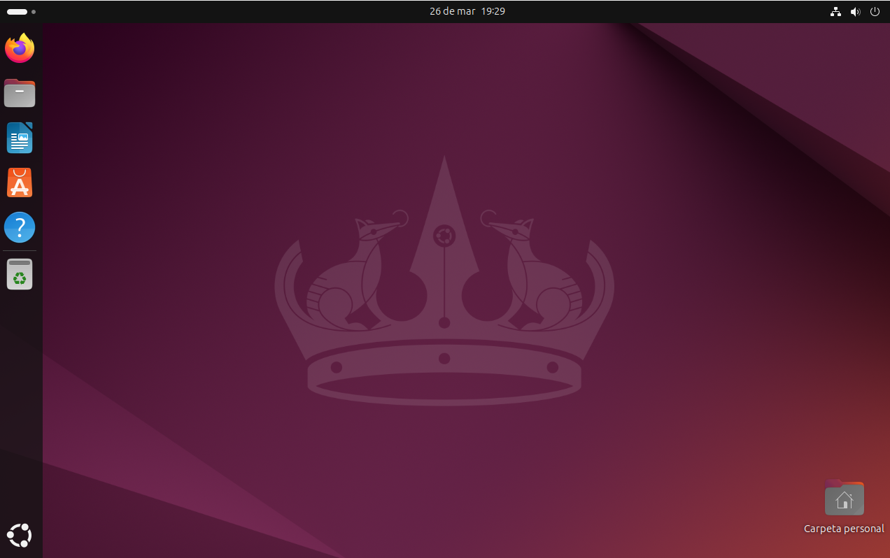

# Proyecto Sistemas Operativos - Tienda Online de Accesorios de Moto

## Descripción
Este proyecto consiste en la instalación y configuración de un sistema operativo para los equipos de una tienda online de accesorios para motociclistas.

## Sistema operativo utilizado
Se ha utilizado Ubuntu Desktop como sistema operativo principal por ser gratuito, seguro y estable.

## Contenido del proyecto
- Elección del sistema operativo
- Instalación del sistema
- Configuración básica
- Gestión de usuarios
- Instalación de software
- Medidas de seguridad

## Instalación
El sistema operativo se ha instalado en una máquina virtual utilizando VirtualBox, configurando correctamente el disco, usuario y entorno del sistema.

## Configuración
Se ha configurado el sistema con red, actualizaciones, nombre del equipo y ajustes básicos para su correcto funcionamiento.

## Usuarios
Se han creado diferentes usuarios con distintos permisos para simular el entorno de una empresa.

## Software instalado
Se han instalado aplicaciones como navegador web y LibreOffice para el trabajo diario.

## Seguridad
Se han aplicado medidas básicas como actualizaciones, contraseñas seguras y control de usuarios.

## Sistema instalado

## Autor
Victoria Teresa Arroyo Peña
